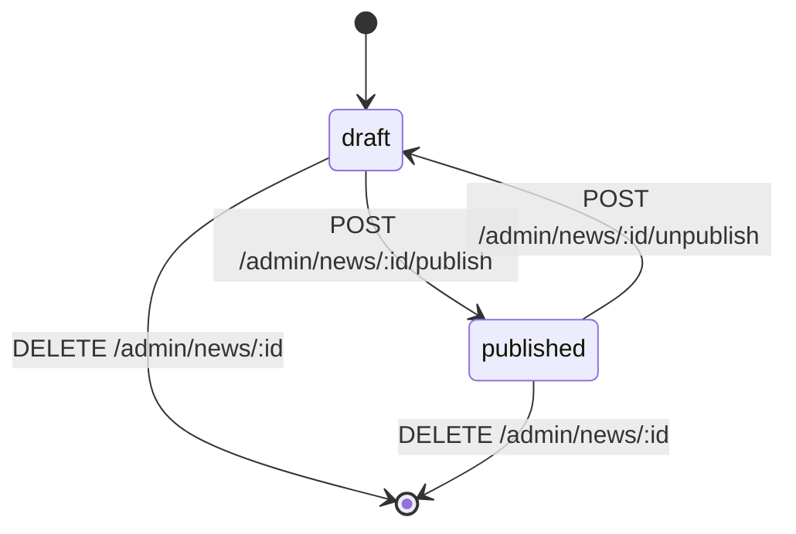

# News Admin Integration and Evolution

## Objetivo

Documentar como o Backoffice Admin deve utilizar o domínio `news` já reconciliado e como o contrato deve evoluir de forma disciplinada no ecossistema HSC.

Este documento existe para:

- explicar o uso correto dos contratos de `news` dentro da SPA administrativa
- transformar o CRUD reconciliado em integração frontend previsível
- registrar o lifecycle funcional do domínio
- orientar a expansão futura do contrato sem gerar drift documental
- indicar onde cada mudança de `news` deve ser documentada

---

## Navegação

### Entrada
- [Home da documentação](../README.md)
- [Backoffice Admin](./README.md)
- [Master Index](../00-governance/99-master-index.md)

### Documentos diretamente relacionados
- [News Admin API Contracts](./news-admin-api-contracts.md)
- [Admin API Contracts](./admin-api-contracts.md)
- [Backoffice Admin Frontend Structure](./backoffice-admin-frontend-structure.md)
- [Auth, RBAC and Guards](./auth-rbac-and-guards.md)
- [Backoffice Admin Operational Runbooks](./backoffice-admin-operational-runbooks.md)

### Relações com outros contextos
- [Auth API Operations](../04-infra-aws-lightsail/auth-api-operations.md)
- [Nginx Publishing and Cache](../03-portal-estatico/nginx-publishing-cache.md)
- [ETL Bash Pipeline](../03-portal-estatico/etl-bash-pipeline.md)
- [Documentation System](../00-governance/documentation-system.md)

---

## Escopo

Este documento cobre:

- consumo do domínio `news` pelo Backoffice Admin
- mapeamento entre contratos HTTP e telas administrativas
- lifecycle funcional do recurso
- orientações de modelagem frontend
- checklist para adição de novos contratos do domínio
- regras documentais para evolução segura

Este documento não cobre em profundidade:

- implementação exata de componentes Angular
- layout visual das telas
- detalhes internos de SQL ou migrations
- operação detalhada do mirror público do Portal

---

## Leitura correta do fluxo end-to-end

O domínio `news` precisa ser lido como uma cadeia com papéis diferentes.

### Cadeia correta

1. o operador autentica no Backoffice
2. o Backoffice consome `/admin/news*`
3. a Auth API aplica regras, transições e persistência
4. `publish` torna o item visível em `/content/news*`
5. o Portal público consome o mirror same-origin de `content/news`

### Erro conceitual a evitar

Não tratar:

- Backoffice Admin
- Auth API
- conteúdo público canônico
- mirror same-origin do Portal

como se fossem a mesma camada.

Cada uma possui papel distinto.

---

## Como o Backoffice utiliza os contratos de `news`

### 1. Listagem administrativa

Tela:

```text
/news
```

Contrato principal:

```http
GET /admin/news
```

Objetivos da tela:

- listar itens existentes
- exibir `status`
- exibir datas relevantes
- disparar publish, unpublish e delete
- abrir criação e edição

Modelagem recomendada:

- tratar `GET /admin/news` como leitura base do domínio no admin
- manter o retorno bruto tipado
- derivar apenas view models leves no frontend

### 2. Criação

Tela:

```text
/news/new
```

Contrato principal:

```http
POST /admin/news
```

Body mínimo confirmado:

- `slug`
- `title`
- `content`

Uso correto:

- montar formulário mínimo com esses três campos
- validar client-side apenas o básico
- deixar a autoridade final de validação no backend
- após sucesso, revalidar a lista ou navegar para edição

### 3. Edição

Tela:

```text
/news/:id/edit
```

Contrato principal confirmado:

```http
PATCH /admin/news/:id
```

Leitura importante:

- a mutação de edição está confirmada
- a leitura dedicada por `id` ainda não está confirmada como superfície canônica

Uso correto no checkpoint atual:

- não tornar a tela dependente de um `GET /admin/news/:id` ainda não reconciliado
- preferir hidratação a partir de cache de listagem, estado roteado ou resultado da criação
- só promover leitura dedicada quando o endpoint existir e for documentado

### 4. Publish e unpublish

Ações na tabela ou na tela de edição:

- publicar
- despublicar

Contratos corretos:

- `POST /admin/news/:id/publish`
- `POST /admin/news/:id/unpublish`

Uso correto:

- tratar essas ações como transições de estado explícitas
- não tentar implementar publish/unpublish via patch de `status`
- após mutação, revalidar o item ou a lista administrativa

### 5. Delete

Ação:

- remoção do item

Contrato:

- `DELETE /admin/news/:id`

Uso correto:

- tratar como mutação destrutiva explícita
- remover o item do estado local apenas após resposta de sucesso
- revalidar lista após exclusão quando a consistência visual for crítica

---

## Lifecycle funcional do recurso

O lifecycle reconciliado do domínio é pequeno e explícito.



### Estado `draft`

Características:

- item existe administrativamente
- não aparece em `GET /content/news`
- pode ser editado
- pode ser publicado
- pode ser removido

### Estado `published`

Características:

- item existe administrativamente
- aparece em `GET /content/news`
- aparece em `GET /content/news/:slug`
- pode voltar para `draft`
- pode ser removido

### Consequência para o frontend

O frontend deve modelar:

- estado administrativo
- ações permitidas por estado
- feedback claro após transição

Exemplo de leitura segura:

- se `status = "draft"` → mostrar ação de publish
- se `status = "published"` → mostrar ação de unpublish

---

## Estratégia recomendada de modelagem frontend

### DTOs separados por superfície

Não usar o mesmo tipo para tudo.

Separação recomendada:

```text
AdminNewsListItem
AdminNewsMutationResponse
PublicNewsListItem
PublicNewsDetail
```

Motivo:

- o contrato administrativo tem `id` e `status`
- o contrato público não tem `id` nem `status`
- o detalhe público contém `content`, a lista pública não

### Serviço de domínio

Estrutura recomendada:

```text
features/news/data-access/news-admin-api.service.ts
```

Operações recomendadas:

- `list()`
- `create(payload)`
- `update(id, payload)`
- `publish(id)`
- `unpublish(id)`
- `remove(id)`

### Mapeamento de payload

Payload mínimo confirmado para criação:

```ts
type CreateNewsPayload = {
  slug: string;
  title: string;
  content: string;
};
```

Payload seguro já confirmado para update:

```ts
type UpdateNewsPayload = {
  title?: string;
  content?: string;
};
```

Regra importante:

- não promover `excerpt`, `image_url` ou `slug` mutáveis como contrato forte do frontend sem reconciliação explícita adicional

---

## Estratégia de revalidação

### Após create

Escolher uma das abordagens abaixo:

- navegar para `/news` e revalidar a lista
- navegar para `/news/:id/edit` usando o `id` retornado
- manter o item recém-criado em estado local e depois reconciliar com listagem

### Após patch

Recomendado:

- atualizar o estado local com o `item` retornado
- ou revalidar a lista se a tela depender de consistência global

### Após publish / unpublish

Recomendado:

- revalidar o item e a lista administrativa
- usar o `status` retornado como fonte imediata de feedback
- não depender de inferência local do estado final

### Após delete

Recomendado:

- remover da coleção local apenas após sucesso
- revalidar a listagem quando houver risco de drift visual

---

## Como adicionar novos contratos ao domínio `news`

A expansão do domínio `news` deve seguir uma ordem disciplinada.

### Passo 1 — classificar o contrato novo

Antes de documentar ou implementar, decidir a qual superfície ele pertence.

Pergunta correta:

- é contrato administrativo do Backoffice?
- é contrato público canônico da Auth API?
- é contrato de mirror same-origin do Portal?
- é contrato transversal de auth/sessão, e não de `news`?

### Passo 2 — identificar a fonte de verdade

A fonte de verdade do contrato novo deve ser explicitada.

Exemplos:

- `GET /admin/news/:id` → `05-backoffice-admin`
- `GET /content/news/:slug` → Auth API como fonte canônica de conteúdo
- `/content/news/<slug>/` → Portal/Nginx como mirror same-origin

### Passo 3 — validar o runtime

Não promover contrato novo apenas por intenção.

É preciso validar, no mínimo:

- método
- path
- auth necessária
- body aceito
- response de sucesso
- erro relevante
- invariantes de estado

### Passo 4 — atualizar o documento correto

Regra editorial:

- contratos transversais de auth/sessão ficam em `admin-api-contracts.md`
- contratos específicos de `news` ficam em `news-admin-api-contracts.md`
- regras de uso e expansão ficam neste documento
- mudanças de publishing público ou mirror same-origin exigem revisão dos documentos de `03-portal-estatico`

### Passo 5 — atualizar navegação

Quando um contrato novo alterar a forma de leitura do contexto, revisar também:

- `docs/05-backoffice-admin/README.md`
- `docs/05-backoffice-admin/backoffice-admin-references-inventory.md`
- `docs/00-governance/99-master-index.md`, se o novo documento passar a ser estrutural

### Passo 6 — só então ajustar a SPA

A implementação frontend deve nascer depois que o contrato estiver:

- validado
- documentado
- localizado no contexto certo
- ligado aos documentos adjacentes corretos

---

## Checklist documental para novo contrato de `news`

Antes de considerar um novo contrato saudável, validar:

1. o path e o método foram testados no runtime real?
2. a auth necessária está explícita?
3. o body aceito está documentado?
4. o shape de sucesso está documentado?
5. pelo menos um erro relevante está documentado?
6. a transição de estado foi descrita?
7. a superfície correta foi identificada?
8. a navegação contextual foi atualizada?
9. a documentação não está escondendo lacunas?
10. a SPA está consumindo o contrato real, e não um contrato imaginado?

---

## Mudanças que pedem expansão imediata deste documento

Este documento deve ser expandido quando houver:

- publicação de `GET /admin/news/:id`
- suporte confirmado para `excerpt`
- suporte confirmado para `image_url`
- validação explícita de erro para slug duplicado
- paginação, filtros ou ordenação server-side em `/admin/news`
- novas transições de estado no lifecycle de `news`
- mudança na fronteira entre conteúdo canônico e mirror do Portal

---

## Anti-padrões a evitar

Os principais anti-padrões para este domínio são:

- usar o mirror same-origin do Portal como contrato admin
- assumir `GET /admin/news/:id` sem confirmação
- transformar publish/unpublish em patch genérico de status
- inventar shape de erro não validado
- misturar contrato público e contrato administrativo no mesmo tipo frontend
- usar impl-log como substituto da documentação canônica do domínio
- expandir UI antes de fechar o contrato real

---

## Leitura canônica atual

A leitura correta do checkpoint atual é:

- o domínio `news` já pode sustentar a primeira feature administrativa real do Backoffice
- o contrato mínimo já é pequeno, estável e suficiente
- a principal disciplina agora não é “imaginar mais endpoints”, e sim evoluir o domínio sem perder a fronteira entre admin, conteúdo canônico e mirror público

---

## Critério de pronto

Este documento está saudável quando:

- explica claramente como o Backoffice deve consumir `news`
- transforma o CRUD reconciliado em fluxo de integração previsível
- orienta expansão futura sem abrir drift documental
- separa contrato, uso e evolução do domínio
- ajuda implementação sem virar backlog ou impl-log disfarçado

---

## Última revisão

- Status: ativo
- Classificação: canônico
- Contexto: `05-backoffice-admin`
- Domínio: `news`
- Última revisão: 2026-03-25
