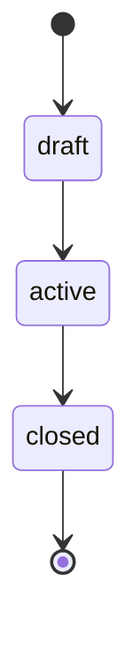

**HAXIXE SMOKE CLUB — Master Viva Oficial**
**Baseline Modular por Contexto**
Gerado em: 2026-03-06 (UTC)

> Este é o documento único e vivo do ecossistema HSC.
> Atualizações devem ocorrer exclusivamente via:
>
> 1. Documento Atômico (HSC_IMPL_YYYY-MM-DD_slug.md)
> 2. Integração via HSC Scope Architect
> 3. Auditoria opcional via HSC Technical Auditor

---

# 0. Glossário HSC

* **HSC** — Haxixe Smoke Club (plataforma híbrida Game + Identity)
* **Contexto A** — Infra Hostinger (Game + Portal + ETL)
* **Contexto B** — Infra AWS Lightsail (Auth-API + MariaDB)
* **Static API v2** — JSON estático gerado por ETL Bash
* **Break-glass** — Autorização administrativa via `X-Admin-Key`
* **Deploy determinístico** — Produção roda exclusivamente por TAG
* **Detached HEAD** — Checkout fixo da TAG no servidor
* **UTC obrigatório** — Todos timestamps assumem UTC
* **PR-1 Seasons** — Sistema de temporadas competitivas
* **Espelho same-origin (News)** — Cache local servido pelo Nginx em `/content/news/*` (Portal), reduzindo dependência de CORS/Auth API no browser

---

# 1. Visão Geral do Ecossistema

Arquitetura híbrida separando:

* **Game + Estatísticas + Portal (Hostinger VPS)**
* **Identidade + Conteúdo + Admin (AWS Lightsail)**

Princípios normativos:

1. Deploy somente por TAG
2. `npm ci` obrigatório
3. Rollback via state file
4. Apenas 1 season ativa
5. `closed` é estado terminal
6. Portal é 100% estático
7. ETL determinístico com `flock`

---

# 2. Contexto A — Infra VPS Runtime (Hostinger / Debian)

## 2.1 Stack Base

* Debian
* Nginx (TLS + static serving)
* AMP Instance Manager
* Docker (CS2 container)
* Certbot (Let's Encrypt)
* systemd timers

## 2.2 Estrutura de Diretórios

* `/var/www/portal/cs2/`
* `/var/www/api/cs2/v2/`
* `/var/www/api/cs2/v2/content/`
* `/var/www/api/cs2/v2/content/news/`
* `/opt/cs2-portal/`
* `/opt/cs2-portal/bin/`
* `/opt/cs2-portal/locks/`
* `/opt/cs2-portal/state/`
* `/usr/local/bin/*.sh`
* `/usr/local/sbin/*.sh`

## 2.3 Modelo de Permissões

* Usuário operacional: `amp`
* Grupo web: `www-data`
* JSONs: `amp:www-data`
* Diretórios com `setgid`
* `umask 0002`
* Escrita atômica com `mv`

## 2.4 Invariantes Operacionais

* ETL nunca roda concorrente
* Nenhum backend dinâmico no portal
* Nginx apenas serve arquivos
* **News via same-origin:** Portal não depende de chamadas browser → Contexto B para `content/news`; consome espelho local servido pelo Nginx

## 2.5 Nginx — Espelho same-origin para `content/news`

Rotas expostas no vhost do Portal para servir cache local em `/var/www/api/cs2/v2/content/news/`:

* `/content/news` → **301** para `/content/news/`
* `/content/news/` → serve `.../content/news/index.json`
* `/content/news/<slug>` → **301** para `/content/news/<slug>/`
* `/content/news/<slug>/` → serve `.../content/news/<slug>.json` (**404 limpo** se ausente)

---

# 3. Contexto A.1 — Stats + ETL + Static API v2

## 3.1 Fonte de Dados

* MatchZy 0.8.15
* SQLite (`matchzy.db`)
* Tabelas:

  * matchzy_stats_matches
  * matchzy_stats_maps
  * matchzy_stats_players

## 3.2 Pipeline Determinístico

Ordem normativa:

1. gen-matches.sh
2. gen-match-details-incremental.sh
3. gen-ranking.sh
4. gen-players-incremental.sh
5. gen-players-from-ranking.sh
6. gen-maps.sh
7. **gen-content-news-cache.sh** (gera `content/news/index.json` a partir do Contexto B; fail-soft)
8. **gen-content-news-items-cache.sh** (gera `content/news/<slug>.json` por item; fail-soft)

Lock global:

```bash
flock /opt/cs2-portal/locks/gen-all-v2.lock
```

Notas operacionais:

* Integração dos steps de news no pipeline v2 ocorre via `/usr/local/bin/gen-all-v2.sh`, reaproveitando o lock global acima.
* Timers dedicados de news (se existentes na implementação) devem permanecer **desabilitados** para evitar concorrência, mantendo a atualização acoplada à cadência do `gen-all-v2`.

## 3.3 Health

Arquivo: `health.json` (publicado em `/api/cs2/v2/health.json`)

Checks (base):

* DB acessível
* JSONs recentes
* Consistência ranking ↔ player JSON

Extensão (observabilidade do espelho de news):

* `content.news` (bloco mínimo)

  * `ok` (bool)
  * `ageSec` (number)
  * `count` (number)
  * `generatedAt` (string JSON segura ou `null`)
  * `source` (string JSON segura ou `null`)

Writer/Unit:

* Writer: `/usr/local/bin/gen-health.sh`
* Unit: `gen-health.service`

**Invariante de payload:** `health.json` deve ser JSON válido (strings emitidas como literais JSON seguros `"..."` ou `null`).

## 3.4 Invariantes

* Incremental monotônico
* Sem concorrência
* Escrita atômica
* Cache curto no Nginx
* **Atomicidade do espelho de news:** publicação por staging (`mktemp`) + `mv`
* **Fail-soft do espelho de news:** em falha de fetch/validação, mantém último cache válido

## 3.5 Deploy determinístico do ETL por TAG (Contexto A)

Governança:

* Scripts críticos (`bin/`) passam a ser versionados no repositório do ETL.
* Releases do ETL seguem TAG (ex.: `etl-v0.2.0`) e produção deve rodar em **detached HEAD**.

Deployer determinístico:

* `/usr/local/sbin/deploy-etl-tag.sh`

  * `git fetch --tags origin`
  * valida TAG
  * `git checkout --detach tags/<TAG>`
  * smoke mínimo (gera cache news sem falhar hard)

State local:

* `/opt/cs2-portal/.deploy_current_tag`
* `/opt/cs2-portal/.deploy_current_tag.prev`

Hardening anti-drift:

* `.deploy_current_tag*` ignorados via `.git/info/exclude`

---

# 4. Contexto A.2 — Portal Estático + CS2 Ops

## 4.1 Portal

* HTML + CSS modular + JS ESModules
* Sem frameworks
* Sem inline scripts
* Rotas:

  * /ranking
  * /matches
  * /match/:id
  * /player/:steamid
  * /maps

Integrações públicas (browser):

* O Portal consome a Static API v2 (arquivos JSON).
* **News (conteúdo):** o Portal consome **same-origin** via `/content/news/` e `/content/news/<slug>/` (espelho local servido pelo Nginx, cache gerado pelo ETL).
* Config afetada: `assets/js/config.js`

  * `NEWS_API_BASE` = `""` (same-origin)

Invariantes:

* **Portal não depende de CORS/Auth API no browser para news.**
* CORS da Auth API permanece relevante para SPAs futuras (Backoffice/Account), não para o consumo de news pelo Portal público.

## 4.2 CS2 Operacional

* AMP controla instância
* Docker container MixHAXIXE01
* Configurações MatchZy versionadas
* Plugins:

  * WeaponPaints
  * MatchZy
  * CS-Simple-Admin

## 4.3 Limitações Estruturais

* Sem eventos por round
* Sem CT/T split real por round
* Sem timeline detalhada

---

# 5. Contexto B — Auth API Runtime (AWS Lightsail)

## 5.1 Infra Base

* Ubuntu 22.04 LTS
* IP estático
* Nginx (TLS + reverse proxy)
* Node.js via systemd
* MariaDB InnoDB local (127.0.0.1)

Paths oficiais:

* `/opt/hsc/hsc-auth-api`
* `/opt/hsc/.deploy-auth-last-tag`
* `/var/log/hsc/deploy-auth.log`

Config (produção):

* `/opt/hsc/hsc-auth-api/.env`

## 5.2 Deploy Determinístico

### 5.2.1 Branch Model (normativo)

* `main` = espelho de produção (tagueável/deployável)
* `develop` = integração da próxima release (**deve conter `main`**)
* `feature/*` nasce de `develop` e volta para `develop` (PR)
* `fix/*` (hotfix) nasce de `main`, volta para `main` (PR) e depois sync em `develop` (PR)
* **Regra:** sem commit direto em `main`/`develop` (somente PR)

### 5.2.2 Release por TAG (workstation)

**TAG `vX.Y.Z` é o artefato oficial de produção.**
Release é criada **somente** a partir do branch `main` via `ops/release.sh` (guardrails):

* exige `main`
* exige working tree limpa
* exige `main` sincronizado com `origin/main`
* impede TAG duplicada
* roda smoke local antes de taguear
* cria TAG anotada e faz push

```bash
./ops/release.sh vX.Y.Z
```

**Invariante pós-release:** `develop` deve conter `main` (sync obrigatório via PR `main → develop` quando necessário).

### 5.2.3 Deploy por TAG (produção — fonte da verdade)

Script oficial (servidor, usuário operacional `hscadmin`):

```bash
/opt/hsc/hsc-auth-api/ops/deploy-auth.sh vX.Y.Z
```

Características normativas do deploy por TAG:

* `git fetch --tags --prune` (tag é unidade de versão)
* checkout forçado da TAG em **detached HEAD**
* `npm ci --omit=dev`
* restart `systemd` (`hsc-auth-api`)
* smoke tests pós-restart
* log: `/var/log/hsc/deploy-auth.log`
* anti-concorrência: `flock` em `/tmp/hsc-auth-deploy.lock`
* rollback determinístico via state file: `/opt/hsc/.deploy-auth-last-tag`

Validação pós-deploy (mínimo operacional):

* `git describe --tags --exact-match`
* `git rev-parse --short HEAD`
* `GET /health` local: `http://127.0.0.1:3000/health`

### 5.2.4 Rollback

Rollback oficial:

```bash
deploy-auth.sh --rollback
```

* Depende do state file `/opt/hsc/.deploy-auth-last-tag`.

### 5.2.5 GitHub Actions (opcional; manual-only)

* Workflow configurado como **manual-only** (`workflow_dispatch`) com `inputs.tag` obrigatório.
* Trigger automático por tag (`push: tags`) permanece removido.
* Fetch/validação de TAG robusta para evitar “tag clobber” (busca explícita do ref de TAG).

## 5.3 Segurança

* `X-Admin-Key` obrigatório para `/admin/*`
* **SEC-002 (fail-closed admin writes):** "No audit, no write" — mutações administrativas (`news`, `seasons`) **só** confirmam se o registro correspondente em `admin_audit_log` for persistido **na mesma transação** (falha no audit => rollback sem side effects).
* CORS restrito por allowlist (**deny-by-default**; nunca liberar `*`)

  * Prioridade: `ALLOWED_ORIGINS` (CSV multi-origin)
  * Compatibilidade: `ALLOWED_ORIGIN` (fallback single-origin)
  * Normalização: `trim` + remoção de trailing slash antes da validação
* MariaDB bound em 127.0.0.1
* SSH por chave
* **Invariante operacional:** `GET /health` não pode falhar e deve refletir a config carregada (incluindo allowlist de CORS)

## 5.4 CORS — Configuração por Variáveis de Ambiente

* `ALLOWED_ORIGINS`: lista CSV de origins permitidos (ex.: `https://haxixesmokeclub.com,https://www.haxixesmokeclub.com`)
* `ALLOWED_ORIGIN`: origin único (mantido apenas como fallback/compat)
* Regras:

  * Se `Origin` não estiver na allowlist, a API não libera CORS (browser bloqueia leitura).
  * Respostas CORS devem variar por `Origin` (ver Contexto B.1).

## 5.5 Hardening Transacional (SEC-002) — Fail-closed em mutações admin

Política: **“No audit, no write”**. Toda mutação administrativa relevante só pode persistir se o respectivo registro em `admin_audit_log` for gravado **na mesma transação** (falha no audit => rollback sem side effects).

Componentes:

* Helper transacional reutilizável:

  * `src/db/adminTx.js`

    * `runInTx(dbConfig, fn)` (begin/commit/rollback + lifecycle da conexão)
    * `insertAdminAudit(conn, payload)` (insert em `admin_audit_log` usando a conexão transacional)

* Injeção de dependências para rotas (reduzir imports dispersos e padronizar wiring):

  * `src/app/context.js` (expor `runInTx` e `insertAdminAudit` via `routesDeps`)
  * `src/routes/register.js` (propagar deps para rotas admin relevantes)

Aplicação inicial (domínios):

* `news` — writes envoltos por transação + audit nas rotas admin; publish usa `UTC_TIMESTAMP()` para `published_at`.
* `seasons` — atomicidade encapsulada no repo (`activateSeasonTx` com locks); rotas passam payload de `audit` para o repo.

Release: `v0.3.10`.

---

# 6. Contexto B.1 — Auth API Contratos HTTP

## 6.1 Público (Read-only)

### GET /health

Contrato (compatível; extensão de payload):

* Body inclui:

  * `allowedOrigins`: lista (array) com a allowlist efetiva carregada
  * `allowedOrigin`: mantido por compatibilidade (derivado do primeiro item de `allowedOrigins`)
* **Invariante:** rota é “smoke/observabilidade” e não deve lançar exceptions.

### GET /content/news

Contrato (extensão de headers; sem mudança de semântica de dados):

* CORS (quando `Origin` ∈ allowlist):

  * `Access-Control-Allow-Origin: <origin>`
  * `Vary: Origin`

### Espelho same-origin de News (Portal) — superfície pública

> Estes endpoints são servidos pelo **Contexto A (Nginx)** e entregam JSONs do cache local gerado pelo ETL.
> Consumidor primário: Portal público (browser).
> Sem dependência de CORS/Auth API no browser.

#### GET /content/news/

* Auth: pública
* Resposta: `index.json` (cache local)
* Normalização: `/content/news` → **301** `/content/news/`

#### GET /content/news/<slug>/

* Auth: pública
* Resposta: `<slug>.json` (cache local)
* Normalização: `/content/news/<slug>` → **301** `/content/news/<slug>/`
* Ausência: **404 limpo** se `<slug>.json` não existir

Observação:

* A fonte canônica de conteúdo continua sendo a Auth API (`/content/news` e `/content/news/:slug`).
* O espelho same-origin reflete a última execução bem-sucedida do pipeline v2 (pode ficar **stale** conforme cadência/indisponibilidade do Contexto B).

### GET /content/seasons

### GET /content/seasons/active

### GET /content/seasons/:slug

---

## 6.2 Admin — Seasons (PR-1)

> **SEC-002:** mutações admin são **fail-closed** (audit transacional obrigatório em `admin_audit_log`).

### POST /admin/seasons

### PATCH /admin/seasons/:slug

### POST /admin/seasons/:slug/activate

### POST /admin/seasons/:slug/close

---

## 6.3 Máquina de Estados — Seasons



Invariantes:

* Apenas 1 season ativa
* closed é terminal
* slug UNIQUE
* start_at < end_at
* UTC obrigatório

---

## 6.4 Admin — News

> **SEC-002:** mutações admin são **fail-closed** (audit transacional obrigatório em `admin_audit_log`).

* GET /admin/news
* POST /admin/news
* PATCH /admin/news/:id
* POST /admin/news/:id/publish
* POST /admin/news/:id/unpublish
* DELETE /admin/news/:id

Invariantes:

* slug UNIQUE
* draft → published
* `published_at` em UTC (`UTC_TIMESTAMP()` no publish)

---

## 6.5 Admin — Events (Estrutura Inicial)

> Base estrutural criada, implementação parcial.

Previsto:

* GET /content/events
* POST /admin/events
* PATCH /admin/events/:id
* DELETE /admin/events/:id
* POST /admin/events/:id/confirm

Status: **Em implementação**

---

# 7. Segurança (Cross-cutting)

* **SEC-002 (fail-closed admin writes):** mutações admin só persistem com audit transacional em `admin_audit_log` ("No audit, no write").
* Break-glass auditável
* Rate limit recomendado em /admin/*
* HSTS recomendado
* Headers de segurança no edge
* Rotação de ADMIN_KEY documentada
* CORS permanece **restrito** (allowlist explícita; deny-by-default; nunca `*`)
* **Fail-soft no espelho de news:** browser nunca depende diretamente do Contexto B para renderizar news; risco principal é staleness controlado por observabilidade

---

# 8. CI/CD (Cross-cutting)

* Deploy somente por TAG
* Detached HEAD obrigatório
* npm ci obrigatório (Contexto B)

## 8.1 Auth API — normas operacionais de release/deploy

* Release **somente** via `ops/release.sh` a partir de `main` (guardrails) e TAG `vX.Y.Z` como unidade de versão.
* Deploy em produção **somente** via TAG (`deploy-auth.sh vX.Y.Z`) e com lock anti-concorrência (`flock` em `/tmp/hsc-auth-deploy.lock`).
* Pós-release: `develop` deve conter `main` (sync `main → develop` via PR quando necessário).
* Rollback determinístico: `deploy-auth.sh --rollback` usando state file `/opt/hsc/.deploy-auth-last-tag`.
* GitHub Actions (quando usado): **manual-only** (`workflow_dispatch`) e com fetch explícito da TAG para evitar clobber.

## 8.2 Smoke tests

* Auth API:

  * `/health` (não pode falhar; deve refletir config carregada)
  * `/content/news`
  * `/content/seasons`
  * `/content/seasons/active`
  * `/admin/schema` (condicional a `ADMIN_KEY`)
  * CORS: validação de `Access-Control-Allow-Origin` e `Vary: Origin` para `Origin` permitido e ausência para `Origin` negado

* VPS / Static API v2:

  * `gen-all-v2` com lock global (não concorrente)
  * `/api/cs2/v2/health.json` válido (incluindo `content.news`)
  * Espelho same-origin:

    * `/content/news/` (200; `index.json`)
    * `/content/news/<slug>/` (200 quando existir; 404 limpo quando não existir)

## 8.3 Deploy por TAG — ETL (Contexto A)

Norma:

* ETL deve ser publicado e implantado por TAG (`etl-vX.Y.Z`) em **detached HEAD** via `/usr/local/sbin/deploy-etl-tag.sh`.
* Statefiles `.deploy_current_tag*` controlam rollback operacional local.

---

# 9. Observabilidade

## Auth API

```bash
journalctl -u hsc-auth-api -f
```

Recomendação:

* Usar `GET /health` como diagnóstico de config, incluindo allowlist efetiva (`allowedOrigins`).

Operação (deploy):

* Log de deploy: `/var/log/hsc/deploy-auth.log`
* Verificação local pós-deploy/rollback: `http://127.0.0.1:3000/health`

## ETL

```bash
systemctl list-timers
journalctl -u gen-all-v2.service
journalctl -u gen-health.service
```

Recomendação:

* Monitorar `content.news.ageSec` no `/api/cs2/v2/health.json` para detectar staleness do espelho.

## Métricas Futuras

* p95/p99 por rota
* Taxa de erro
* Uso de admin-key
* Health checks automatizados

---

# 10. Failure Domains

| Domínio                      | Impacto                                                                      |
| ---------------------------- | ---------------------------------------------------------------------------- |
| Hostinger VPS                | Portal + Stats offline                                                       |
| AWS Lightsail                | Auth API offline (Portal continua servindo **news stale** via espelho local) |
| MariaDB                      | Conteúdo/Admin indisponível                                                  |
| Nginx                        | Edge indisponível                                                            |
| ETL lock falho               | API v2 inconsistente                                                         |
| Deploy lock órfão (Auth API) | Deploy bloqueado até limpeza manual do lockfile                              |

---

# 11. Lacunas Abertas

* Confirmar DDL real de:

  * users
  * profiles
  * news
  * schema_meta
* Implementar UNIQUE guard para season ativa
* Rate limit formal em /admin/*
* Snapshot determinístico de rotas por TAG
* OpenAPI versionado
* Observabilidade estruturada
* Hardening adicional do edge
* Risco de misconfig em produção: `ALLOWED_ORIGINS` pode não incluir todos os origins legítimos (ex.: variação com/sem `www`)
* Consumidores que parseiam estritamente `/health` devem tolerar campo adicional `allowedOrigins` (compat mantida via `allowedOrigin`)
* Falta smoke automatizado específico para CORS (simular `Origin` permitido e negado) e garantir que `/health` nunca quebre
* **Staleness do espelho de news:** se o Contexto B ficar indisponível por longos períodos, o Portal serve o último cache bom; falta alarme automatizado usando `content.news.ageSec`
* **Acoplamento de atualização:** com timers dedicados de news desabilitados, a atualização de news fica acoplada à cadência do `gen-all-v2` (avaliar estratégia dedicada sem quebrar lock global)
* **Governança ponta a ponta por TAG:** ETL passou a ter deploy determinístico por TAG; padronizar e auditar gating/pinning determinístico entre Contexto A e Contexto B (processo e evidências operacionais)
* **Deploy (Auth API) permanece majoritariamente manual:** depende de disciplina operacional (guardrails do release, execução no servidor, validações e sync pós-release entre branches).
* **Lockfile órfão de deploy (Auth API):** abortos (SSH/runner) podem deixar `/tmp/hsc-auth-deploy.lock` bloqueando deploy; requer playbook curto de detecção e limpeza segura (somente quando não houver processo ativo).
* **Instabilidade operacional do GitHub Actions (manual-only):** workflow pode falhar; fallback é deploy manual no servidor (manter runbook e critérios de quando acionar o fallback).
* **Fail-closed sem testes de integração formais:** ausência de suíte automatizada que valide continuamente “no audit, no write” nas rotas admin (validação atual via smoke/ritual).
* **`admin_audit_log` ainda “lean”:** falta enriquecimento (ex.: diff/payload, `request_id`, IP, user-agent) para rastreabilidade futura.
* **Propagação do padrão:** política aplicada a `news` e `seasons`; domínios admin futuros devem adotar o mesmo padrão transacional.

---

# 12. Roadmap Plataforma (Contexto C)

## 12.1 Backoffice SPA

* Interface para News
* Interface para Seasons
* Interface para Events
* RBAC real (roles persistidas)

## 12.2 Account SPA

* Perfil
* Configurações
* Histórico
* Preferências

## 12.3 Evolução RBAC

* user
* editor
* admin
* future: moderator

---

# 13. ChangeLog

## 2026-03-06

* auth-api-git-flow-release-tag — Contextos afetados (A, B)

  * Formalizado Git Flow (main/develop/feature/fix) e release determinístico por TAG `vX.Y.Z` com guardrails em `ops/release.sh`; deploy por TAG em detached HEAD com `deploy-auth.sh`, smoke pós-restart, lock via `flock` e rollback por state file; GitHub Actions manual-only com fetch robusto de TAG.

* auth-api-git-release-deploy-workflow — Contextos afetados (A, B)

  * Registrado playbook operacional end-to-end (release por TAG, deploy no Lightsail, validações pós-deploy, rollback, sync pós-release `main → develop`, diagnósticos de lock e fallback quando Actions falhar).

* auth-api-fail-closed-admin-audit — Contextos afetados (B, B.1)

  * Hardening **SEC-002**: mutações admin (`news`, `seasons`) passam a ser **fail-closed** com auditoria transacional (“no audit, no write”) gravada em `admin_audit_log` na mesma transação; publish de news força `published_at` em UTC (`UTC_TIMESTAMP()`); release por TAG `v0.3.10`.

## 2026-03-03

* content-news-mirror-and-etl-tag-deploy — Contextos afetados (A, A.1, A.2, B.1)

  * Portal passou a consumir News via espelho same-origin (`/content/news/*`) servido pelo Nginx com cache local; pipeline v2 integra geração transacional sob lock global e `health.json` expõe `content.news` (staleness/contagem).
  * Governança: ETL agora possui deploy determinístico por TAG (detached HEAD) com statefiles locais e tag de release `etl-v0.2.0`.

## 2026-03-02

* auth-api-content-news-cors-allowlist — Contextos afetados (A, A.2, B, B.1)

  * Auth API: CORS com allowlist multi-origin via `ALLOWED_ORIGINS` (fallback `ALLOWED_ORIGIN`), deny-by-default + normalização; `/health` corrigido e passa a expor `allowedOrigins` mantendo compat.

## 2026-02-27

* Integração Auth API v4
* Integração PR-1 Seasons
* Estrutura inicial de Events
* Modularização oficial por Contexto

---

Este documento é a fonte única de verdade do estado atual da plataforma HSC.
Atualizações futuras devem ocorrer exclusivamente via pipeline oficial: Documento Atômico → Scope Architect → (Auditor opcional).

