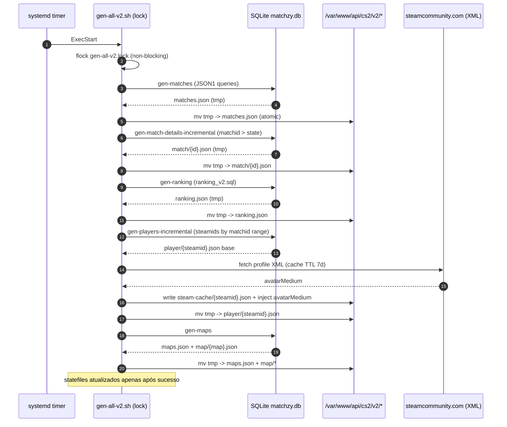

# HSC Master Blueprint — Documentação Técnica Definitiva (Deep Scan)
**Projeto:** HAXIXE SMOKE CLUB (HSC)  
**Versão do Blueprint:** 2026 (fev)  
**Data de geração:** 2026-02-25  
**Escopo:** VPS (Debian + Nginx + AMP + Docker) + CS2 (MatchZy/SQLite) + ETL Bash (Static JSON API v2) + Portal Estático (HTML/CSS/JS) + Auth API (Node/Express + MariaDB) + RBAC inicial + Roadmap Backoffice/Account

> Este documento consolida TODOS os documentos anexados do projeto HSC e explicita **dependências ocultas**, **contratos**, **regras operacionais**, **regras de negócio**, e **pontos de evolução**.

---

## Navegação rápida

- [Legacy](./README.md)
- [Home da documentação](../README.md)
- [Master Index](../00-governance/99-master-index.md)
- [HSC MASTER DOCUMENTATION](./HSC_MASTER_DOCUMENTATION.md)
- [Master Documents Migration Map](./master-documents-migration-map.md)


## 0) Glossário rápido (nomes que aparecem nos docs)
| Termo | Significado | Onde impacta |
|---|---|---|
| AMP | AMP Instance Manager (Hostinger Game Panel) que gerencia instâncias (CS2) e container base | CS2 runtime, paths sob `/home/amp/.ampdata/...` |
| MatchZy | Plugin do CounterStrikeSharp que grava estatísticas em SQLite (`matchzy.db`) | Fonte de verdade de stats |
| Static JSON API v2 | API “100% arquivo” gerada por ETL (SQLite → JSON) | Portal consome via fetch |
| Portal CS2 | Frontend público sem framework (HTML/CSS/JS) | Exibição de ranking/matches/players/maps |
| Auth API | Backend central de autenticação/conteúdo (news) + base de usuários/perfis | Admin/backoffice e account futuramente |
| RBAC | Role-Based Access Control (user/editor/admin) aplicado nas rotas admin | Segurança de /admin/* |
| Break-glass | Caminho operacional “sempre disponível” para manter controle (X-Admin-Key) | Resiliência operacional |

---

## 1) Visão Geral — Propósito do ecossistema HSC
O HSC é um ecossistema de comunidade para **Counter-Strike 2**, focado em:

1. **Operar um servidor CS2 confiável** (baixo lag, alta disponibilidade, processos determinísticos).
2. **Extrair, normalizar e publicar estatísticas** do servidor sem expor banco nem backend runtime.
3. **Publicar um portal público estático** com navegação e UX refinados consumindo apenas JSON estático.
4. **Centralizar identidade e conteúdo** via Auth API (Magic Link + usuários/perfis + News CRUD) e preparar a evolução para:
   - backoffice (staff/admin) e
   - account (usuário final).

### Princípios “não-negociáveis” detectados nos docs
| Princípio | Implementação concreta | Consequência |
|---|---|---|
| Zero backend dinâmico no portal | Portal = HTML/CSS/JS puro | Portal escala por cache/CDN, sem custo de compute |
| SQLite nunca exposto | Nginx bloqueia extensões e dotfiles | Surface area mínima, sem risco de dump |
| Atomicidade | Geração em temp + `mv -f` | Evita JSON parcial/corrompido |
| Concorrência controlada | `flock` e lock global | Evita corrida entre timers/cron |
| Separação de camadas | `portal/*` vs `api/*` vs `auth-api/*` | Evolução sem acoplamento |
| CORS restrito | `ALLOWED_ORIGIN` | Portal/backoffice controlam origem |

---

## 2) Arquitetura de Sistemas (padrões, fluxo de dados e integrações)

### 2.1 Padrão arquitetural por sub-sistema
| Sub-sistema | Padrão | Observações |
|---|---|---|
| CS2 + Stats | “Data producer” (plugin) + DB local | MatchZy escreve em SQLite no disco da instância AMP |
| ETL v2 | Batch incremental (idempotente) | Incremental por `matchid` e por `steamid64` |
| Static JSON API | “Static file API” | Contratos de JSON versionados via pasta `v2/` |
| Portal público | SPA estática “sem backend” | Renderização client-side, sem SSR |
| Auth API | Microserviço REST | Node/Express + MariaDB; expõe `/content/*` e `/admin/*` |
| RBAC | Guard/Policy layer | `requireMinRole()` + `getEffectiveRole()` |

### 2.2 Diagrama do ecossistema (alto nível)
```mermaid
flowchart LR
  subgraph Internet
    U[Usuário/Browser]
    S[Steam Community\n(XML / profiles)]
  end

  subgraph VPS["VPS Hostinger (Debian)"]
    N[Nginx + SSL (Let's Encrypt)]
    P[Portal Estático\n/var/www/portal/cs2]
    A[Static JSON API v2\n/var/www/api/cs2/v2]
    ETL[ETL Bash + systemd timers\n/usr/local/bin + /opt/cs2-portal]
    DB[(SQLite matchzy.db\nMatchZy)]
    AMP[AMP + Docker (CS2)]
  end

  subgraph Auth["Auth API (Node/Express)"]
    API[auth-api service\n(Node/Express)]
    MDB[(MariaDB)]
  end

  U -->|HTTPS| N
  N --> P
  N --> A
  N -->|/auth-api/* ou subdomínio| API
  AMP --> DB
  DB --> ETL
  ETL --> A
  ETL -->|enrich (cache)| S
  API --> MDB
  P -->|fetch JSON| A
  P -->|futuro: login/account| API
```

### 2.3 Fluxo de dados — CS2 → Portal (cadeia determinística)
**Fonte de verdade:** `matchzy.db` (SQLite).  
**ETL:** scripts bash consultam SQLite e escrevem JSON estático (API v2).  
**Portal:** consome JSON (fetch) e renderiza.

Dependências ocultas (críticas):
- SQLite precisa ter extensão **JSON1** habilitada (uso intensivo de `json_object`, `json_group_array`).
- O ETL depende de **paths estáveis** da instância AMP (instância `MixHAXIXE01`) até o arquivo `matchzy.db`.
- O Nginx precisa estar alinhado com os aliases corretos para `/api/*` e `/portal/*`.

### 2.4 Fluxo de dados — Auth/Conteúdo → Portal
O portal não “faz login” ainda no core CS2, mas o ecossistema já tem:
- Auth API com endpoints públicos (`/content/news`, `/content/news/:slug`) e administrativos (`/admin/*`).
- CORS controlado por `ALLOWED_ORIGIN`, preparando SPAs futuras (`backoffice.*`, `account.*`).

---

## 3) Infraestrutura (providers, containers, redes, CDNs, segurança)

### 3.1 Inventário de ambientes detectados
| Ambiente | Onde roda | Responsabilidade |
|---|---|---|
| VPS Debian | Hostinger VPS | Nginx, portal, static API v2, timers/systemd, AMP host |
| AMP/Docker | Na VPS (via AMP) | CS2 container e plugins |
| Auth API (VPS) | Em alguns docs: VPS com systemd + Nginx proxy | Node/Express escutando porta interna (ex.: 3001) |
| Auth API (Hostinger Business) | Em docs v1.3 | Node Addon gerenciado + CDN/SSL do Hostinger; DB em `127.0.0.1` |

> Observação: os documentos indicam **dois modelos possíveis** para Auth API (VPS vs Hostinger Business). O blueprint consolida ambos como **estratégias suportadas**, com recomendação para fixar um deles via “source of truth” (Nginx + DNS).

### 3.2 Infra VPS (camadas)
- Debian (host)
- Nginx (TLS termination + static serving + reverse proxy)
- systemd timers/services (ETL e health)
- AMP Instance Manager (orquestra instância CS2)
- Docker (container base do CS2 via AMP)

### 3.3 Rede e DNS
- DNS direto para VPS (sem CDN) no domínio principal e `www`.  
- Em Hostinger Business, `auth-api` pode ser ALIAS para a CDN/Proxy Hostinger.  
- SSL:
  - VPS: Let's Encrypt (certbot HTTP-01) com certificados em `/etc/letsencrypt/live/haxixesmokeclub.com/`.
  - Hostinger Business: SSL automático (gerenciado).

### 3.4 Segurança (ameaças e controles)
| Vetor | Risco | Controle atual | Lacunas / próximos passos |
|---|---|---|---|
| Exposição de SQLite | Vazamento de stats e PII (steam ids) | Nginx deny `.db/.sqlite` e dotfiles | Garantir que não existam cópias em `/var/www` |
| JSON parcial | Portal quebrado / dados incoerentes | `mktemp` + validação + `mv` atômico | Adicionar validação JSON via `jq -e` quando disponível |
| Corrida em ETL | Arquivos inconsistentes | `flock` global (`gen-all-v2.lock`) | Garantir que TODOS os timers chamem wrappers com lock |
| Admin takeover | CRUD de conteúdo e controle | `X-Admin-Key` + RBAC guard | Migrar para auth real (magic link + JWT/Session) |
| CORS aberto | Abuso de endpoints | `ALLOWED_ORIGIN` fixo | Backoffice e account exigirão política por ambiente |
| Secrets em disco | Vazamento de DB_PASS, ADMIN_KEY | `.env` fora de git | Reforçar perms (600) e separar por user |

---

## 4) Catálogo de APIs (endpoints, autenticação e contratos de dados)

### 4.1 Static JSON API v2 (CS2)
**Base:** `https://haxixesmokeclub.com/api/cs2/v2/` (ou alias equivalente no Nginx)

#### Endpoints (arquivos)
| Recurso | Método | Caminho | Observações |
|---|---|---|---|
| Health (ETL) | GET | `/api/cs2/v2/health.json` | sinaliza frescor de ranking/matches |
| Ranking | GET | `/api/cs2/v2/ranking.json` | score híbrido (impact/kd/winRate) |
| Matches (lista) | GET | `/api/cs2/v2/matches.json` | últimos 50 finalizados |
| Match detail | GET | `/api/cs2/v2/match/{matchid}.json` | stats por mapa e totais por time |
| Maps (lista) | GET | `/api/cs2/v2/maps.json` | agregados por mapa |
| Map detail | GET | `/api/cs2/v2/map/{map}.json` | lifetime + recentes |
| Player dossier | GET | `/api/cs2/v2/player/{steamid64}.json` | lifetime/7d/30d, byMap, timeline |
| Steam cache | GET | `/api/cs2/v2/steam-cache/{steamid64}.json` | cache de avatar; TTL 7d |

#### Contrato de dados (exemplo: player dossier v2)
Campos relevantes (não exaustivo):
- `generatedAt`, `steamid64`, `name`
- `lifetime`: kills/deaths/assists, adr, hs%, utility, accuracy, v1/v2, multikills, impactRating, winRate, score
- `periods`: `7d` e `30d` com subset
- `byMap[]`, `recentMaps[]`, `timeline[]`
- enrichment:
  - `avatarMedium` e `steamProfileUrl`

**Regras de negócio implícitas do ranking v2**
- Filtra mapas “finalizados” (`winner <> ''`) e com rounds >= `min_rounds_map` (12).
- Remove jogadores com amostragem baixa (`roundsPlayed >= min_rounds_total` = 100).
- Score final: `((impact*0.60)+(kd*0.25)+(winRate*0.15))*sampleWeight`, onde `sampleWeight` cresce até 300 rounds.

---

### 4.2 Auth API (backend central)
**Base pública:** `https://auth-api.haxixesmokeclub.com` (modelo explicitado) ou reverse proxy equivalente.

#### Endpoints públicos
| Método | Caminho | Auth | Contrato |
|---|---|---|---|
| GET | `/health` | none | status API + DB + CORS |
| GET | `/content/news` | none | lista conteúdo publicado |
| GET | `/content/news/:slug` | none | detalhe notícia publicada |

#### Endpoints administrativos
| Método | Caminho | Auth | Role mínima |
|---|---|---|---|
| GET | `/admin/schema` | `X-Admin-Key` (break-glass) + RBAC | admin |
| GET | `/admin/news` | idem | editor |
| POST | `/admin/news` | idem | editor |
| PATCH | `/admin/news/:id` | idem | editor |
| POST | `/admin/news/:id/publish` | idem | admin |
| POST | `/admin/news/:id/unpublish` | idem | admin |
| DELETE | `/admin/news/:id` | idem | admin |
| GET | `/admin/whoami` | opcional (diagnóstico) | n/a |

#### RBAC (estado atual)
- Tabela `users` possui `role` com default `user`.
- Hierarquia: `user < editor < admin`.
- **Bypass operacional:** `X-Admin-Key` define role efetiva como `admin` (break-glass).
- Preparado para futura auth por token (magic link / session).

---

## 5) Domínios e Subdomínios (hierarquia completa)

### 5.1 Domínio principal (produção)
- `haxixesmokeclub.com`
- `www.haxixesmokeclub.com`

### 5.2 Subdomínios atuais observados
| Subdomínio | Função | Origem |
|---|---|---|
| `auth.haxixesmokeclub.com` | frontend de login/account (origem permitida no CORS) | `ALLOWED_ORIGIN` |
| `auth-api.haxixesmokeclub.com` | backend Auth API (público) | docs v1.3/v3 |

### 5.3 Subdomínios futuros (roadmap, já padronizados nos docs)
| Subdomínio | Tipo | Consome |
|---|---|---|
| `backoffice.*` | SPA (staff/admin) | `/admin/*` da Auth API |
| `account.*` | SPA (usuário final) | `/account/*` (futuro) |

---

## 6) Dependências escondidas e “regras operacionais”
> Aqui está o “deep scan” real: o que **não aparece** como requisito explícito, mas é necessário para tudo funcionar.

### 6.1 Dependências de filesystem (paths críticos)
| Artefato | Path (referência) | Consumidor | Risco |
|---|---|---|---|
| SQLite MatchZy | `/home/amp/.ampdata/instances/MixHAXIXE01/counter-strike2/730/game/csgo/addons/counterstrikesharp/plugins/MatchZy/matchzy.db` | ETL (sqlite3) | mudança de instância AMP quebra tudo |
| SQL versionado | `/opt/cs2-portal/sql/*.sql` | ETL | drift de schema MatchZy |
| Locks | `/opt/cs2-portal/locks/gen-all-v2.lock` | timers e scripts | lock ausente gera corrida |
| Statefiles | `/opt/cs2-portal/state/*_last_matchid` | incremental | state corrompido regenera universo |
| Output API | `/var/www/api/cs2/v2/*` | Nginx/Portal | perms erradas quebram fetch |
| Portal | `/var/www/portal/cs2/*` | Nginx | cache agressivo pode servir versão antiga |

### 6.2 Convenções de permissões (modelo amp/www-data)
- Scripts usam `umask 0002`.
- Arquivos gerados: `chmod 664`, `chown amp:www-data` (best-effort).
- Pastas de API/state: `2775` (setgid) em alguns trechos para herdar grupo.

Regra implícita: **tudo que Nginx serve deve ser legível por `www-data`**.

### 6.3 Schedulers: systemd timers vs cron
ETL é acionado via systemd timers (ex.: health cada 1 min; ranking/players/matches a cada 15 min/h).  
Regra de ouro: **não rodar ETL manual concorrente sem respeitar lock**.

---

## 7) Estratégias de Negócio / Crescimento (extraídas dos docs)
### 7.1 Estratégia técnica como estratégia de produto
- **Static portal + static API** permite servir muitos usuários com custo mínimo.
- Versionamento de API (`v2`) permite evoluir contratos sem quebrar o portal.
- A pipeline incremental por `matchid` evita O(N) em todo tick → escalabilidade linear controlada.

### 7.2 Roadmap coerente detectado
| Fase | Entrega | Valor |
|---|---|---|
| Agora (fev/2026) | CS2 stats + portal + news CRUD + RBAC mínimo | comunidade tem “prova social” e conteúdo |
| Próximo | Backoffice SPA + gestão de roles | operação segura sem depender de admin-key |
| Próximo | Account SPA + magic link real | onboarding de usuários e features sociais |
| Próximo | “Eventos” (MVP) | agendar partidas e confirmar presença |
| Evolução | Dados avançados (se plugin suportar) | melhorar stats (CT/T, rounds, heatmaps) |

### 7.3 Regras de escalabilidade
- Preferir **expandir por arquivos** (cache/CDN) antes de “colocar backend”.
- Se adicionar backend (Auth API), manter **bounded context**:
  - Auth/Users/Content/Admin numa API.
  - Stats continuam “read-only static” enquanto possível.

---

## 8) Apêndice — Diagramas lógicos (descritos)

### 8.1 Pipeline ETL v2 (incremental)


### 8.2 Segurança de rotas (Auth API)
```mermaid
flowchart TD
  R[Request /admin/*] --> K{X-Admin-Key válido?}
  K -- sim --> A[Role efetiva = admin]
  K -- não --> U[Role efetiva = user (por enquanto)]
  A --> G{requireMinRole(minRole)}
  U --> G
  G -- ok --> H[Handler]
  G -- fail --> E[401/403]
```

---

## 9) Checklist de “source of truth” (para não haver drift)
| Item | Onde deve estar “o oficial” | Como validar |
|---|---|---|
| DNS e domínios | painel DNS (Hostinger) + `/etc/nginx/sites-enabled/*` | `dig`, `nginx -T` |
| Paths do DB | AMP instance path | `ls -l` no path do `matchzy.db` |
| Timers | `/etc/systemd/system/*.timer` e `systemctl list-timers` | `systemctl status` |
| Contratos JSON v2 | `/opt/cs2-portal/sql/*.sql` + outputs em `/var/www/api/cs2/v2` | `jq '.' file` |
| Auth API | (VPS systemd) ou (Hostinger Node addon) — escolher um | `curl /health` e logs |

---

## 10) Referências (documentos varridos)
- `HSC_DOCUMENTACAO_TECNICA_CONSOLIDADA_HSC.md`
- `HSC_DOCUMENTACAO_TECNICA_01.md`
- `HSC_Web_Infrastructure_DNS_NGINX.md`
- `CS2_Portal_Arquitetura_Tecnica.md`
- `HSC_CS2_PORTAL_DOCUMENTACAO_TECNICA_COMPLETA.md`
- `HSC_CS2_PORTAL_RUNBOOK_OPERACIONAL_COMPLETO.md`
- `HSC_AUTH_API_DOCUMENTACAO_TECNICA_v1.md`
- `HSC_AUTH_API_DOCUMENTACAO_COMPLETA.md`
- `HSC_AUTH_API_DEPLOY_DOCUMENTATION.md`
- `HSC_DOCUMENTACAO_TECNICA_OFICIAL_AUTH_API-v3.md`
- `HSC_AUTH_API_DOCUMENTACAO_TECNICA_HOSTINGER_v1.3.md`
- `HSC_RBAC_DOCUMENTACAO_TECNICA_2026-02-25.md`
